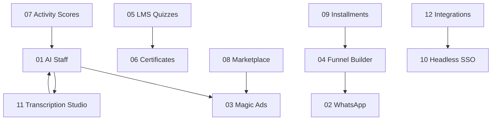

# Chabaqa Feature Implementation Plans

**Created:** 2026-05-18  
**Context:** [Competitive feature analysis](../competitive-feature-analysis.md) · [AI competitive research](../ai-competitive-research.md)  
**Design reference:** [.agents/skills/frontend-design/SKILL.md](../../.agents/skills/frontend-design/SKILL.md)

This folder contains **one implementation plan per major capability gap**. Each plan is self-contained with backend, frontend, design, data models, APIs, phases, and acceptance criteria grounded in the current codebase.

---

## Plans index

| # | Plan | File | Est. effort | Depends on |
|---|------|------|-------------|------------|
| 01 | AI Staff + Cofounder (object creation) | [01-ai-staff-cofounder.md](./01-ai-staff-cofounder.md) | 8–12 weeks | AI module, create-with-me |
| 02 | WhatsApp deep integration & broadcast | [02-whatsapp-integration.md](./02-whatsapp-integration.md) | 6–8 weeks | Policy quotas, contacts |
| 03 | AI Magic Ads / paid acquisition | [03-ai-magic-ads.md](./03-ai-magic-ads.md) | 6–10 weeks | 01 (AI), Meta Marketing API |
| 04 | Built-in funnel builder | [04-funnel-builder.md](./04-funnel-builder.md) | 8–10 weeks | Email campaigns, checkout |
| 05 | Course quizzes & graded assessments | [05-course-quizzes-lms.md](./05-course-quizzes-lms.md) | 5–7 weeks | Courses, progression |
| 06 | Certificates of completion | [06-certificates-completion.md](./06-certificates-completion.md) | 4–6 weeks | 05 (optional), progression |
| 07 | Member activity scores | [07-member-activity-scores.md](./07-member-activity-scores.md) | 4–6 weeks | content-tracking, analytics |
| 08 | Platform marketplace / discovery | [08-platform-marketplace-discovery.md](./08-platform-marketplace-discovery.md) | 5–7 weeks | explore, communities API |
| 09 | BNPL / installments checkout | [09-bnpl-installments-checkout.md](./09-bnpl-installments-checkout.md) | 6–8 weeks | payment.controller, orders |
| 10 | Headless Member API + SSO | [10-headless-api-sso.md](./10-headless-api-sso.md) | 8–12 weeks | auth, JWT, communities |
| 11 | Video transcription & content studio | [11-video-transcription-studio.md](./11-video-transcription-studio.md) | 6–9 weeks | video module, media, AI |
| 12 | Integrations hub (Zapier, Slack, CRM) | [12-integrations-hub.md](./12-integrations-hub.md) | 8–12 weeks | webhooks, OAuth patterns |

---

## Recommended execution waves

### Wave 1 — Foundation (weeks 1–8)
High leverage, builds on existing code:
1. **01** AI Staff packaging (extends `ai-create`, tutor, support)
2. **06** Certificates (UI stub exists; clear member value)
3. **07** Activity scores (data already in `content-tracking`)
4. **08** Marketplace API (unify `/explore` fan-out)

### Wave 2 — Revenue & retention (weeks 6–16)
5. **05** LMS quizzes
6. **09** Installments checkout
7. **04** Funnel builder
8. **02** WhatsApp (MENA differentiator)

### Wave 3 — Scale & ecosystem (weeks 12–24)
9. **12** Integrations hub
10. **10** Headless API + SSO
11. **11** Transcription studio
12. **03** Magic Ads (external API + compliance heavy)

---

## Shared technical conventions

### Backend
- **Domain layout:** `backend/src/domains/{domain}/` with `*.module.ts`, `*.controller.ts`, `*.service.ts`
- **Schemas:** `backend/src/infrastructure/database/schemas/`
- **Shared:** `backend/src/shared/` for cross-cutting (payment, tracking, policy)
- **DTOs:** class-validator + Swagger decorators
- **Jobs:** `@nestjs/schedule` or Bull queue (introduce `QueueModule` if not present for async AI/transcode)

### Frontend
- **Creator:** `frontend/app/(creator)/creator/`
- **Community member:** `frontend/app/(community)/[creator]/[feature]/`
- **Landing:** `frontend/app/(landing)/`
- **API client:** `frontend/lib/api/*.api.ts` + register in `frontend/lib/api/index.ts`
- **i18n:** `frontend/messages/{en,fr,ar}.json` for all user-facing strings

### Design system (from frontend-design skill)
- **Avoid:** generic purple gradients, Inter-only typography, cookie-cutter dashboards
- **Chabaqa creator AI surfaces:** editorial + utilitarian — crisp hierarchy, monospace accents for AI “terminal” panels, warm sand/stone neutrals with one sharp accent (existing community `primaryColor` propagated)
- **Member AI widgets:** soft, approachable; clear “AI” badge; never impersonate humans
- **Use:** existing Radix + Tailwind tokens; Framer Motion for wizard step transitions only (not gratuitous)

### Plan gating
- Enforce via `PolicyService` + `frontend/lib/plans/plan-config.ts` + `FeatureGate`
- Map new features to `PlanFeatures` in `plan.schema.ts` and seed-plans

### Security baseline (all plans)
- Community-scoped data access on every query
- Creator-only mutations with `CommunityPermission` checks
- AI: prompt versioning, rate limits, audit logs, human approval before send/publish
- Webhooks: HMAC signatures, idempotency (`processed-webhook-event.schema.ts` pattern)

---

## Cross-plan dependencies diagram

---

## How to use these plans

1. Read the plan’s **Current state** section and verify files still match (code drifts).
2. Create a GitHub project/epic per plan file.
3. Implement **Phase 1** only before expanding scope.
4. Update plan checkboxes in PR descriptions.
5. Link Postman collections under `docs/postman/` per feature.
